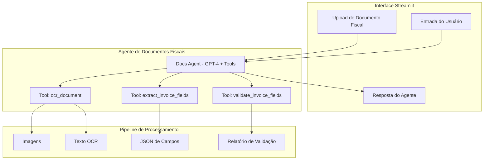

# 📄 CRM-IA – Sistema Inteligente de Captura e Validação de Documentos Fiscais

Sistema de **captura, leitura e validação de documentos fiscais brasileiros** (DANFE, DACTE, NFS-e) baseado em **Agentes de IA Autônomos**, **OCR** e **Modelos de Linguagem Multimodais (MLLMs)**.

Processa PDFs e imagens, extrai campos estruturados, valida CNPJ, chave de acesso, datas e valores, e entrega um JSON pronto para integrar com ERPs, contabilidade e análises fiscais.

---

## 🌟 Funcionalidades

### 🧠 Agente de Documentos Fiscais (tool-based)

- **📥 Ingestão Inteligente de Arquivos**  
  Recebe PDFs e imagens (DANFE, DACTE, NFS-e) e organiza em um pipeline de processamento.

- **🔎 OCR Automático**  
  Converte páginas em texto legível com OCR (ex.: Tesseract), suportando múltiplas páginas e variações de qualidade.

- **🤖 Extração Estruturada com GPT-4**  
  Usa GPT-4 para transformar texto OCR em um JSON com campos padronizados:
  - tipo_documento  
  - chave_acesso  
  - cnpj_emitente / cnpj_destinatario  
  - razão social  
  - data_emissao  
  - valor_total  

- **✅ Validação de Campos**  
  Regras de negócio para:
  - Validação de formato de CNPJ  
  - Chave de acesso com 44 dígitos  
  - Datas em formato válido  
  - Valores numéricos coerentes  

- **🧑‍💻 HITL (Human-in-the-Loop)**  
  Quando a confiança é baixa, o sistema indica campos suspeitos para revisão humana.

---

## 🛠️ Tools do Agente

O agente de documentos fiscais é tool-based e utiliza três ferramentas principais:

- **`ocr_document`**  
  Converte o arquivo (PDF/imagem) em texto por meio de OCR.

- **`extract_invoice_fields`**  
  Recebe o texto OCR e retorna um JSON com os campos principais da nota fiscal usando GPT-4.

- **`validate_invoice_fields`**  
  Aplica validações (CNPJ, chave, data, valor) e retorna um relatório de confiança com flags de campos problemáticos.

---

## 🧠 Arquitetura de Agente

#🚀 Quick Start
1. Clone o repositório
git clone https://github.com/seu-usuario/crm-ia-docs.git
cd crm-ia-docs

2. Crie e ative o ambiente virtual
python -m venv venv
 - Windows
venv\Scripts\activate
-  Linux/Mac
source venv/bin/activate

3. Instale as dependências
pip install -r requirements.txt

4. Configure variáveis de ambiente

Crie um arquivo .env na raiz:

echo "OPENAI_API_KEY=sk-sua-chave-aqui" > .env

📁 Estrutura do Projeto
crm-ia-docs/
├── streamlit_docs.py                 # Interface Streamlit para documentos fiscais
├── app/
│   ├── docs/
│   │   └── invoice_pipeline.py       # Pipeline: ingestão, OCR, extração, validação
│   ├── agent/
│   │   ├── docs_tools_spec.py        # Especificação das tools para o GPT-4
│   │   ├── docs_tools_runtime.py     # Binding tool_name -> função Python
│   │   └── docs_agent.py             # Agente de documentos (loop GPT-4 + tools)
│   └── memory/                       # (Opcional) Memória de sessões/resultados
├── requirements.txt
└── README.md

🎯**Fluxo de Uso**
1. 📤 Upload do Documento

2. 💬 Pergunta para o Agente

Digite algo como:

“Leia esta nota fiscal, extraia os campos principais e valide se está consistente.”

3.**🤖 Execução do Agente**

O agente:

- Chama ocr_document para rodar OCR.
  
- Chama extract_invoice_fields (GPT-4) para extrair o JSON de campos.
  
- Chama validate_invoice_fields para validar CNPJ, chave, datas e valores.

- Consolida tudo em uma resposta final para você, incluindo:
  
- Resumo em texto
  
- JSON de campos
  
- Relatório de validação (score de confiança, campos suspeitos)

4.**🧑‍💻 Revisão Humana (HITL)**

Se o score for baixo, o sistema indica:

- quais campos estão suspeitos;
  
- quais precisam ser revisados manualmente.
  
- Isso pode ser conectado a uma tela específica de revisão (futuro).

🧠**Tecnologias**

🧠 GPT-4 (OpenAI) – extração estruturada inteligente

🔎 Tesseract (pytesseract) – OCR de documentos fiscais

📦 Streamlit – interface rápida para prototipagem

🐍 Python – linguagem principal

🗃️  SQLite/Postgres – persistência de resultados

🔒**Segurança**

Dados permanecem localmente enquanto você não conectar a bancos externos.

A chave da API OpenAI é carregada via .env e não é versionada.

É possível anonimizar documentos antes do envio para a IA, se desejado.

🤝**Contribuindo**

Faça um fork do projeto

Crie uma branch: feature/nova-funcionalidade

Faça commits bem descritos

Abra um Pull Request

Sugestões de melhorias:
- validações fiscais mais sofisticadas;
- integração com ERP;
- suporte a outros tipos de documentos;
- dashboards de qualidade dos dados extraídos.

📄** Licença**
Este projeto está sob a licença MIT. Veja o arquivo LICENSE para mais detalhes.

CRM-IA – Transformando pilhas de papel em dados confiáveis, com IA de ponta e agentes inteligentes. 📄🤖✨
